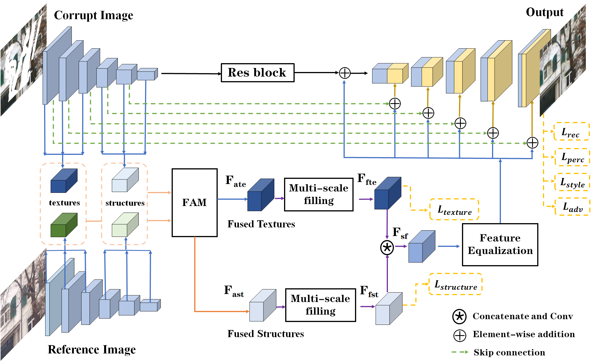

# Reference-Guided Texture and Structure Inference for Image Inpainting

[](https://ieeexplore.ieee.org/abstract/document/9897592)


 This is the repository of the paper **Reference-Guided Texture and Structure Inference for Image Inpainting**, accepted by [ICIP 2022](https://2022.ieeeicip.org/).
 
 > **Abstract:** *Existing learning-based image inpainting methods are still in challenge when facing complex semantic environments and diverse hole patterns. The prior information learned from the large scale training data is still insufficient for these situations. Reference images captured covering the same scenes share similar texture and structure priors with the corrupted images, which offers new prospects for the image inpainting tasks. Inspired by this, we first build a benchmark dataset containing 10K pairs of input and reference images for reference-guided inpainting. Then we adopt an encoder-decoder structure to separately infer the texture and structure features of the input image considering their pattern discrepancy of texture and structure during inpainting. A feature alignment module is further designed to refine these features of the input image with the guidance of a reference image. Both quantitative and qualitative evaluations demonstrate the superiority of our method over the state-of-the-art methods in terms of completing complex holes.* 




## Usage Instructions

### Environment
Please install Anaconda, Pytorch. For other libs, please refer to the file requirements.txt.
```
git clone https://github.com/Cameltr/RGTSI.git
conda create -n RGTSI python=3.8
conda activate RGTSI
pip install -r requirements.txt
```

### Dataset Preparation

Please download DPED10K dataset from [Google Drive](https://drive.google.com/drive/folders/1CdtWeEqQaZM8RWcPX3m1PyC1BGDcmq-N?usp=share_link) or [Baidu Netdisk](https://pan.baidu.com/s/18mwRhUdKsKaL6J-08mdlLQ) (Password: roqs). Create a folder and unzip the dataset into it, then edit the pathes of the folder in `options/base_options.py`

Our model is trained on the irregular mask dataset provided by [Liu et al](https://arxiv.org/abs/1804.07723). You can download publically available Irregular Mask Dataset from their [website](http://masc.cs.gmu.edu/wiki/partialconv).

For Structure image of datasets, we follow the [Structure flow](https://github.com/RenYurui/StructureFlow) and utlize the [RTV smooth method](http://www.cse.cuhk.edu.hk/~leojia/projects/texturesep/).Run generation function [data/Matlab/generate_structre_images.m](./data/Matlab/generate_structure_images.m) in your matlab. For example, if you want to generate smooth images, you can run the following code:

```
generate_structure_images("path to dataset root", "path to output folder");
```

### Training and Testing
```bash
# To train on the you dataset, for example.
python train.py --st_root=[the path of structure images] --de_root=[the path of ground truth images] --input_mask_root=[the path of mask images] --ref_root=[the path of reference images]
```
There are many options you can specify. Please use `python train.py --help` or see the options

For the current version, the batchsize needs to be set to 1.

To log training, use `--./logs` for Tensorboard. The logs are stored at `logs/[name]`.

```bash
# To test on the your dataset, for example.
python test.py  
```
Please edit the the path of test images in `test.py` when testing on your dataset.

### Pre-trained weights and test model
Download pretrained models [here](https://pan.baidu.com/s/1Oh4cqFNgJorOjdxDAugkng) (Password: bb0j).


## Citation
If you use this code or dataset for your research, please cite our papers.
```
@inproceedings{liu2022reference,
  title={Reference-guided texture and structure inference for image inpainting},
  author={Liu, Taorong and Liao, Liang and Wang, Zheng and Satoh, Shin’Ichi},
  booktitle={2022 IEEE International Conference on Image Processing (ICIP)},
  pages={1996--2000},
  year={2022},
  organization={IEEE}
}
```

## Acknowledgments
RGTSI is bulit upon the [MEDFE](https://github.com/KumapowerLIU/Rethinking-Inpainting-MEDFE) and inspired by [SSEN](https://github.com/Slime0519/CVPR_2020_SSEN). We appreciate the authors' excellent work!